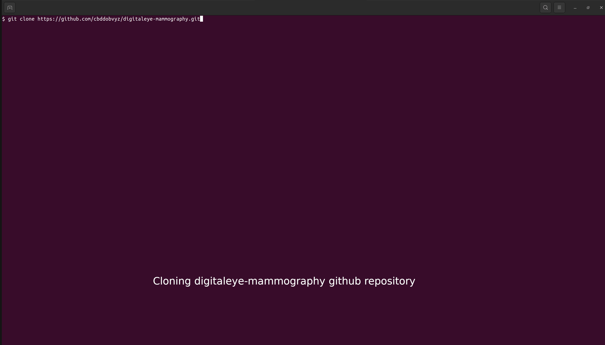

**<center><h1> DOCKER USAGE STEPS </h1></center>**

```bash 
# Clone digitaleye-mammography repository
git clone https://github.com/cbddobvyz/digitaleye-mammography.git


# Change directory to digitaleye-mammography/docker/
cd digitaleye-mammography/docker/

#Build a container for a service according to Dockerfile, Once the setup and container creating processes are complete, Visit the localhost:8888/lab address for running Jupyter Lab
docker compose -f docker-compose-cpu.yml up

# Create a folder to upload images into. Then upload images into folder.
mkdir data

# Check the Usage Examples topic in readme file
python3 mass_inference.py --model_enum 3 8 10 --img_path data/ --classify_mass False
```

<b> Steps are showed in below with GIF </b>




<b> For more details, steps explained in [docker_usage_tutorial.pdf](../docs/docker_usage_tutorial.pdf) </b>