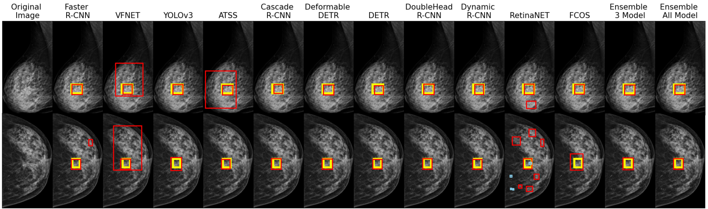
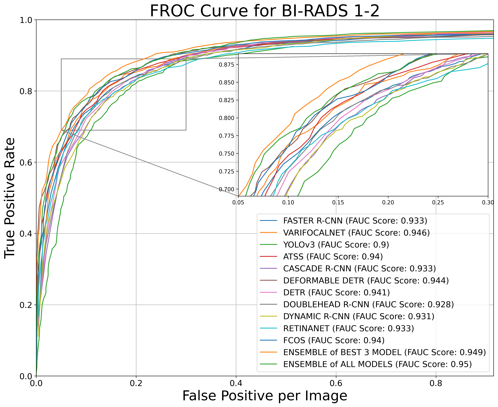
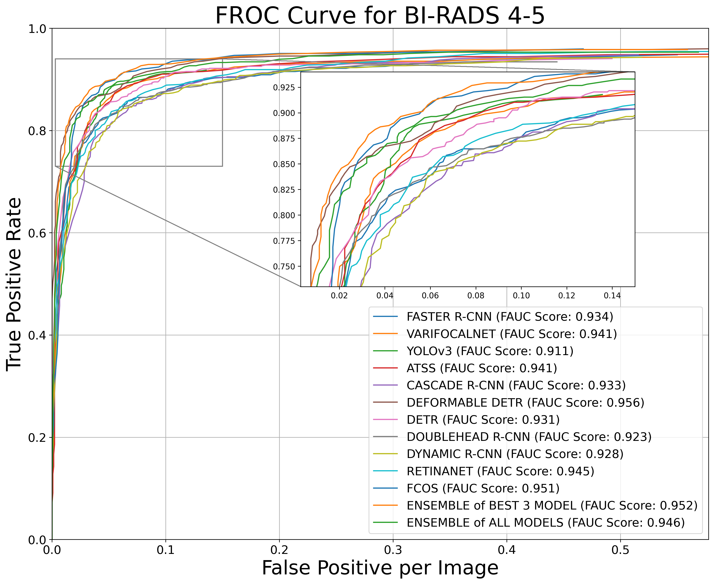

<div align="center" markdown="1">


**<center><h1> DIGITAL EYE for MAMMOGRAPHY (DEM) </h1></center>**

**Transfer learning and ensemble-ready deep learning SOTA object detection models for breast cancer detection.** [](https://twitter.com/intent/tweet?text=Transfer%20learning%20and%20ensemble-ready%20deep%20learning%20SOTA%20object%20detection%20models%20for%20breast%20cancer%20detection%20repository&url=https://github.com/ddobvyz/digitaleye-mammography&via=dijital&hashtags=DigitalEye,AI,BreastCancer,EarlyDiagnosis,OpenSource)
</div>

<div align="center">
<p align="center">
  <a href="https://cbddo.gov.tr/en/projects/digital-eye-project/">Website</a> •
  <a href="#installation">Installation</a> •
  <a href="#getting-started">Getting Started</a> •
  <a href="#implemented-model-architectures">Benchmarks</a> •
  <a href="#community">Community</a> •
  <a href="#license">License</a> •
  <a href="#disclaimer">Disclaimer</a> 
</p>
 <p align="center">
  
  
  <a href="https://github.com/ddobvyz/digitaleye-mammography/releases/tag/shared-models.v1" ></a>
  <a href="https://join.slack.com/t/supergradients-comm52/shared_invite/zt-10vz6o1ia-b_0W5jEPEnuHXm087K~t8Q"></a>
  <a href="https://github.com/ddobvyz/digitaleye-mammography/blob/main/LICENSE"></a>
 </p>   
</div>   

## **Introduction**

Breast cancer is both the most prevalent type of cancer across the world and a malignant disease with the highest rate of cancer-related mortality among women. Breast cancer comes first among the most prevalent types of cancer in TÜRKİYE.

As the Digital Transformation Office of the Presidency of the Republic of Türkiye, we are carrying out the Digital Eye Project (Breast Cancer Detection with Artificial Intelligence) in order to assist radiologists in screenings with mammography applied for the early diagnosis of breast cancer and to reduce their workload. 



Key features of DEM include:

* **Powered by Carefully Prepared Data:** This project is built on meticulously prepared and labeled KETEM dataset.

* **Transfer Learning Made Easy:** You can use this repository as a source for transfer learning, making it easier to leverage pre-trained models and adapt them to new tasks.

* **Boost Performance with Ensemble Models:** With various strategies, this project allows you to combine outputs from different deep learning architectures, enhancing the overall performance.

* **Compatible with MMDetection:** This project plays well with [MMdetection](https://github.com/open-mmlab/mmdetection), making it effortless to use and open to developers for adding new features.

* **Visualize and Compare Model Results:** Get a visual representation of your model's performance and generate detailed comparison reports. Calculate scientific metrics like True Positive Rate (TPR), Average Precision (AP) for each class, and mean Average Precision (mAP).

* **Open-Source and Accessible:** This toolkit is available as an open-source project, fostering collaboration and enabling developers to contribute and benefit from its features.

## **Benchmarks**

Results and models are available in the below. 
  
    
|   Model | Class | TPR | FPPI | AP | mAP | Checkpoints |
| :------: | :-----------: | :-------: | :-----------: | :---------------: | :---------: | :---------: |
| <b> Faster R-CNN  | BI-RADS 4-5 <br> BI-RADS 1-2 | 0.948 <br> 0.958 | 0.55 <br> 0.872 | 0.908 <br> 0.892 | 0.9  | [checkpoint](https://github.com/ddobvyz/digitaleye-mammography/releases/download/shared-models.v1/fasterrcnn.pth) |
| <b> DoubleHead R-CNN | BI-RADS 4-5 <br> BI-RADS 1-2 | 0.944 <br> 0.953 | 0.499 <br> 0.848 | 0.903 <br> 0.883 | 0.893 | [checkpoint](https://github.com/ddobvyz/digitaleye-mammography/releases/download/shared-models.v1/doublehead_rcnn.pth) |
| <b> Dynamic R-CNN | BI-RADS 4-5 <br> BI-RADS 1-2 | 0.943 <br> 0.958 | 0.519 <br> 0.791 | 0.898 <br> 0.882 | 0.89  | [checkpoint](https://github.com/ddobvyz/digitaleye-mammography/releases/download/shared-models.v1/dynamic_rcnn.pth) |
| <b> Cascade R-CNN | BI-RADS 4-5 <br> BI-RADS 1-2 | 0.948 <br> 0.96 | 0.516 <br> 0.865 | 0.9 <br> 0.884 | 0.892 | [checkpoint](https://github.com/ddobvyz/digitaleye-mammography/releases/download/shared-models.v1/cascade_rcnn.pth) |
| <b> YOLOv3 | BI-RADS 4-5 <br> BI-RADS 1-2 | 0.918 <br> 0.925 | 0.136 <br> 0.514 | 0.891 <br> 0.842 | 0.867 | [checkpoint](https://github.com/ddobvyz/digitaleye-mammography/releases/download/shared-models.v1/yolo_v3.pth) |
| <b> RetinaNET | BI-RADS 4-5 <br> BI-RADS 1-2 | 0.966 <br> 0.967 | 1.801 <br> 3.152 | 0.916 <br> 0.89 | 0.903  | [checkpoint](https://github.com/ddobvyz/digitaleye-mammography/releases/download/shared-models.v1/retina_net.pth) |
| <b> FCOS | BI-RADS 4-5 <br> BI-RADS 1-2 | 0.96 <br> 0.961 | 0.467 <br> 1.049 | 0.93 <br> 0.906 | 0.918 | [checkpoint](https://github.com/ddobvyz/digitaleye-mammography/releases/download/shared-models.v1/fcos.pth) |
| <b> VarifocalNET | BI-RADS 4-5 <br> BI-RADS 1-2 | 0.961 <br> 0.976 | 1.859 <br> 3.104 | 0.915 <br> 0.908 | 0.911 | [checkpoint](https://github.com/ddobvyz/digitaleye-mammography/releases/download/shared-models.v1/varifocal_net.pth) |
| <b> ATSS | BI-RADS 4-5 <br> BI-RADS 1-2 | 0.954 <br> 0.965 | 0.941 <br> 1.259 | 0.916 <br> 0.906 | 0.911 | [checkpoint](https://github.com/ddobvyz/digitaleye-mammography/releases/download/shared-models.v1/atss.pth) |
| <b> DETR | BI-RADS 4-5 <br> BI-RADS 1-2 | 0.941 <br> 0.969 | 0.493 <br> 1.025 | 0.913 <br> 0.899 | 0.906 | [checkpoint](https://github.com/ddobvyz/digitaleye-mammography/releases/download/shared-models.v1/detr.pth) |
| <b> DEDETR | BI-RADS 4-5 <br> BI-RADS 1-2 | 0.966 <br> 0.967 | 1.235 <br> 1.797 | 0.941 <br> 0.914 | 0.927 | [checkpoint](https://github.com/ddobvyz/digitaleye-mammography/releases/download/shared-models.v1/deformable_detr.pth) |
| <b> ENSEMBLE of BEST 3 MODELS <br> ATSS, DEDETR, FCOS | BI-RADS 4-5 <br> BI-RADS 1-2 | 0.958 <br> 0.968 | 0.575 <br> 1.020 | 0.937 <br> 0.922 | 0.929 | --- |
| <b> ENSEMBLE of ALL MODELS | BI-RADS 4-5 <br> BI-RADS 1-2 | 0.953 <br> 0.971 | 0.573 <br> 1.033 | 0.928 <br> 0.918 | 0.923 | --- |
<p align="center">
  
   
</p>   

## **Installation**

```bash
pip install -r requirements.txt
```

## **Getting Started**

The parameters for running the DEM toolkit in the terminal are provided below. 

```--model_enum:``` represents the user's model selection *(Required Parameter)*
```python
    {0: 'ATSS'
     1: 'CASCADE R-CNN'
     2: 'DEFORMABLE DETR'
     3: 'DETR'
     4: 'DOUBLEHEAD R-CNN'
     5: 'DYNAMIC R-CNN'
     6: 'FASTER R-CNN'
     7: 'FCOS'
     8: 'RETINANET'
     9: 'VARIFOCALNET'
     10: 'YOLOv3'
    }
```
    
```--img_path: ``` file path for test images *(Required Parameter)*
    
```--device:``` running device *(Optional Parameter, Default: 'cpu')*
    
```--classify_mass:``` mass classification flag *(Optional Parameter, Default: True)*
    
```--segment_breast: ``` Mamografi görüntülerinde meme bölgesine odaklanılması için segmentasyon modelinin çalışmasını ifade eder. *(Optional Parameter, Default True olarak setlenmiştir.)*
    
```--enable_ensemble: ``` Modellerin ürettiği sonuçlara ensemble uygulanıp uygulanamayacağını ifade eder. *(Optional Parameter, Default  False olarak setlenmiştir.)*

```--annotation_path: ``` Verilen mamografi görüntüleri için ground truth annotation yolunu ifade eder. *(Optional Parameter, Default None olarak setlenmiştir.)* 
    
```--nms_iou_threshold: ``` Model çıktılarına NMS uygulanması için gerekli IoU değerini ifade eder. (Optional Parameter, Default 0.1 olarak setlenmiştir.)*
    
```--confidence_threshold: ``` Model çıktılarına skor eliminasyonu için gerekli skor değerini ifade eder. (Optional Parameter, Default 0.05 olarak setlenmiştir.)* 
    
```--ap_threshold: ``` Model çıktılarının ground truth ile kesişim eşik değerinin TP olarak değerlendirilmesi için gerekli olan IoU değerini ifade eder. *(Optional Parameter, Default 0.1 olarak setlenmiştir.)* 

### KULLANIM ÖRNEKLERİ    

Mamografi görüntülerinizi içeren verisetlerinizi paylaştığımız modeller üzerinde test etmek için sunduğumuz kullanım senaryolarını aşağıdan inceleyebilirsiniz. 

* Model tahmini sonuçları görsellenir ve kaydedilir.

```python3 mass_inference.py --model_enum ${MODEL_NUMBERS} --img_path ${IMAGE_FOLDER_PATH}```

* Mamografi görüntüleri, meme segmentasyon modeli ile segmente edilir, nesne tespit modeline girdi olarak verilir, sonuçlar görsellenir ve kaydedilir.

```python3 mass_inference.py --model_enum ${MODEL_NUMBERS} --img_path ${IMAGE_FOLDER_PATH} --segment_breast ${BOOLEAN}```    

* Model tahmini sonuçları ground truth bilgileri ile birlikte görsellenir ve  kaydedilir.

```python3 mass_inference.py --model_enum ${MODEL_NUMBERS} --img_path ${IMAGE_FOLDER_PATH} --annotation_path ${ANNOTATION_PATH}```

* Kitle tespiti veya sınıflandırılması seçimi yapılması
    
```python3 mass_inference.py --model_enum ${MODEL_NUMBERS} --img_path ${IMAGE_FOLDER_PATH} --classify_mass ${BOOLEAN}``` 

* Modellerin tahmini ve ensemble sonuçları görsellenir ve kaydedilir.
    
```python3 mass_inference.py --model_enum ${MODEL_NUMBERS}--img_path ${IMAGE_FOLDER_PATH} --enable_ensemble ${BOOLEAN}```
  
* Model çıktılarına verilen IoU eşik değerinde NMS uygulanır. Model sonuçları görsellenir ve kaydedilir.

```python3 mass_inference.py --model_enum ${MODEL_NUMBERS} --img_path ${IMAGE_FOLDER_PATH} --nms_iou_threshold ${FLOAT}```

* Model çıktılarına verilen confidence eşik değerinde eliminasyon yapılır. Model sonuçları görsellenir ve kaydedilir.
    
```python3 mass_inference.py --model_enum ${MODEL_NUMBERS} --img_path ${IMAGE_FOLDER_PATH} --confidence_threshold ${FLOAT}```

* TP olarak kabul edilecek IoU eşik değeri seçilir. Model çıktı metrikleri bu parametre ile hesaplanır.

```python3 mass_inference.py --model_enum ${MODEL_NUMBERS} --img_path ${IMAGE_FOLDER_PATH} --annotation_path ${ANNOTATION_PATH} --ap_threshold ${FLOAT}```

## License
      
This project is released under the [GNU/GPLv3](https://github.com/ddobvyz/digitaleye-mammography/blob/main/LICENSE)
      
## Disclaimer

THERE IS NO WARRANTY FOR THE PROGRAM, TO THE EXTENT PERMITTED BY APPLICABLE LAW.  EXCEPT WHEN OTHERWISE STATED IN WRITING THE COPYRIGHT HOLDERS AND/OR OTHER PARTIES PROVIDE THE PROGRAM "AS IS" WITHOUT WARRANTY OF ANY KIND, EITHER EXPRESSED OR IMPLIED, INCLUDING, BUT NOT LIMITED TO, THE IMPLIED WARRANTIES OF MERCHANTABILITY AND FITNESS FOR A PARTICULAR PURPOSE.  THE ENTIRE RISK AS TO THE QUALITY AND PERFORMANCE OF THE PROGRAM IS WITH YOU.  SHOULD THE PROGRAM PROVE DEFECTIVE, YOU ASSUME THE COST OF ALL NECESSARY SERVICING, REPAIR OR CORRECTION.

THIS REPOSITORY DOES NOT PROVIDE MEDICAL ADVICE. THE INFORMATION, INCLUDING BUT NOT LIMITED TO, TEXT, GRAPHICS, IMAGES, AND OTHER MATERIAL CONTAINED ON THIS REPOSITORY ARE FOR INFORMATIONAL PURPOSES ONLY. NO MATERIAL ON THIS REPOSITORY IS INTENDED TO BE A SUBSTITUTE FOR PROFESSIONAL MEDICAL ADVICE, DIAGNOSIS, OR TREATMENT. ALWAYS SEEK THE ADVICE OF YOUR PHYSICIAN OR OTHER QUALIFIED HEALTH CARE PROVIDER WITH ANY QUESTIONS YOU MAY HAVE REGARDING A MEDICAL CONDITION OR TREATMENT, AND NEVER DISREGARD PROFESSIONAL MEDICAL ADVICE OR DELAY IN SEEKING IT BECAUSE OF SOMETHING YOU HAVE READ ON THIS REPOSITORY.
      
THE CONTENT OF REPOSITORY IS PROVIDED FOR INFORMATION PURPOSES ONLY. NO CLAIM IS MADE AS TO THE ACCURACY OR CURRENCY OF THE CONTENT ON THIS REPOSITORY AT ANY TIME. THE DIGITAL TRANSFORMATION OFFICE DOES NOT ACCEPT ANY LIABILITY TO ANY PERSON/INSTITUTION/ORGANIZATION FOR THE INFORMATION OR MODEL (OR THE USE OF SUCH INFORMATION OR MODEL) WHICH IS PROVIDED ON THIS REPOSITORY OR INCORPORATED INTO IT BY REFERENCE.

## Citing
    

    
## Acknowledgements
    

    

